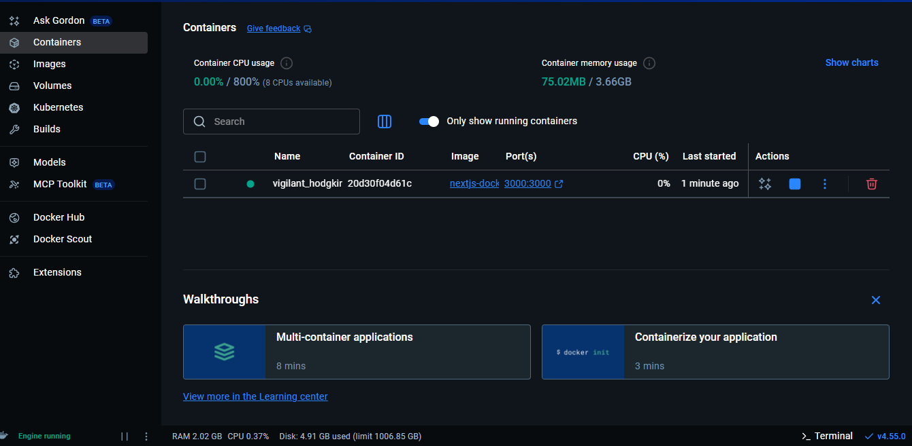
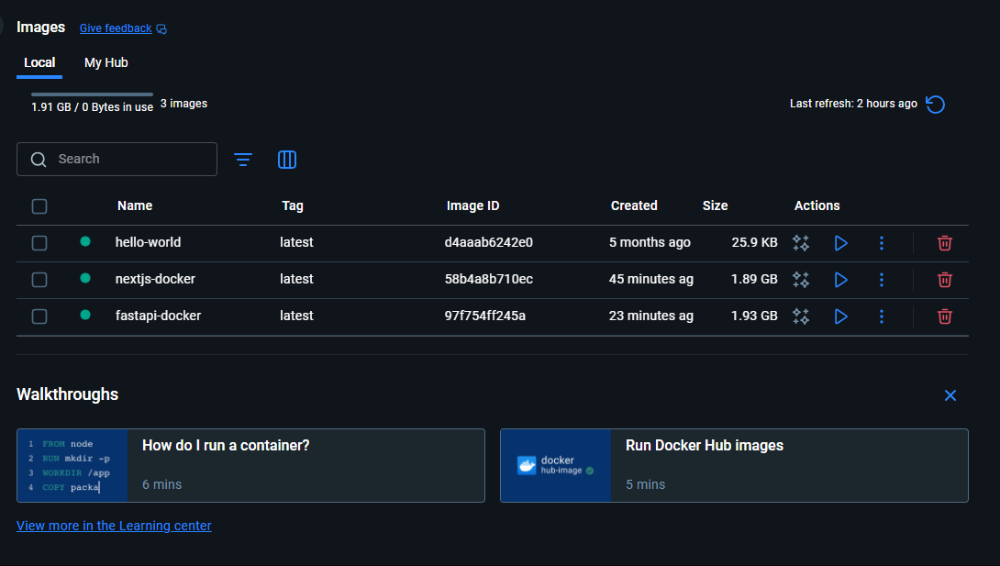
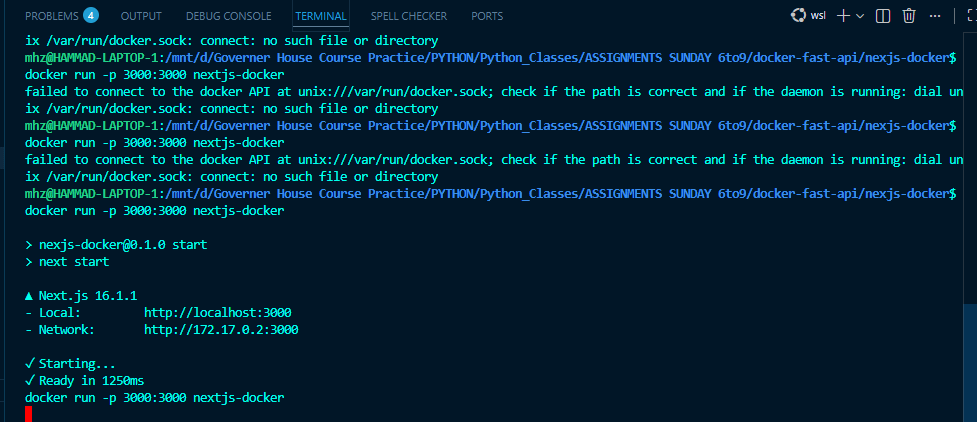
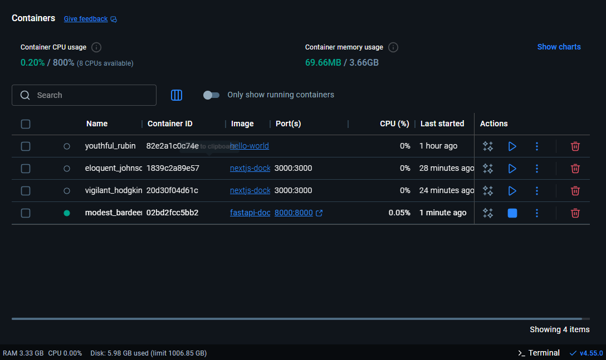
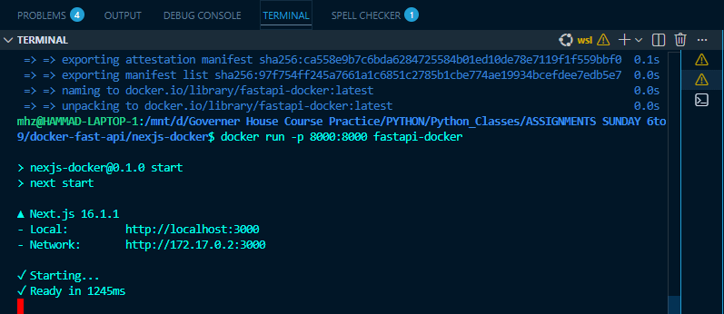

# 🐳 Class 13 Assignment - Docker Containerization
**Author:** Muhammad Hammad Zubair  
**Date:** January 04  
**Course:** GIAIC - Sunday Class  

---

## 🎯 Assignment Goal

Hello there! 👋 Welcome to your **Docker adventure**.  
In this assignment, we are going to:

1. Create **2 containerized projects**:
   - `nextjs-docker` (Frontend / Next.js)
   - `fastapi-docker` (Backend / FastAPI)
2. Build Docker **images** from these projects
3. Run **containers** from these images
4. Capture **Docker Desktop screenshots** for verification ✅

> Think of Docker like a **virtual kitchen**:
> - Recipe = Dockerfile 🍳  
> - Ingredients = Your app files 📂  
> - Chef = Docker engine 🧑‍🍳  
> - Dish = Running container 🍲

---

# 🟦 PART 1 — Next.js Docker Project

## Step 1️⃣ — Create Next.js Project

Run this command in your terminal:

```bash
npx create-next-app@latest nextjs-docker
````

**Explanation / Backend Story:**

* `npx create-next-app@latest` → NPX downloads the latest Next.js starter project without installing globally.
* `nextjs-docker` → Name of the folder where the project will live.

**Real-Life Analogy:**
It’s like ordering a **cake mix** online. You got the base ingredients ready in a box.

---

## Step 2️⃣ — Create Dockerfile

Inside `nextjs-docker` folder, create a **file named exactly `Dockerfile`** (no extension!).

```dockerfile
# 1️⃣ Base Image
FROM node:22-alpine

# 2️⃣ Set Working Directory
WORKDIR /app

# 3️⃣ Copy dependency files
COPY package*.json ./

# 4️⃣ Install dependencies
RUN npm install

# 5️⃣ Copy all project files
COPY . .

# 6️⃣ Build project for production
RUN npm run build

# 7️⃣ Open port for container
EXPOSE 3000

# 8️⃣ Command to run app
CMD ["npm", "start"]
```

**Line-by-Line Explanation:**

| Line                    | Meaning                             | Analogy                           |
| ----------------------- | ----------------------------------- | --------------------------------- |
| `FROM node:22-alpine`   | Use Node.js 22 on lightweight Linux | Choosing the base kitchen 🏠      |
| `WORKDIR /app`          | All commands run in `/app` folder   | Your cooking table 🍳             |
| `COPY package*.json ./` | Copy dependency info                | Shopping list 📝                  |
| `RUN npm install`       | Install all dependencies            | Buy ingredients 🛒                |
| `COPY . .`              | Copy your whole project             | Bring ingredients to kitchen 🍅🥚 |
| `RUN npm run build`     | Build Next.js for production        | Bake the cake 🍰                  |
| `EXPOSE 3000`           | Open port 3000                      | Open oven door for customers 🌐   |
| `CMD ["npm","start"]`   | Start the app                       | Serve the cake 🍽️                |

---

## Step 3️⃣ — Build Docker Image

Run this command in **nextjs-docker folder**:

```bash
docker build -t nextjs-docker .
```

**Explanation:**

* `docker build` → Docker reads Dockerfile and makes an **image**.
* `-t nextjs-docker` → Tag (name) for your image.
* `.` → Use current folder as **context** (ingredients & recipe).

**Common Errors & Fixes:**

* ❌ `failed to read dockerfile` → Wrong folder or Dockerfile name
  ✅ Fix: Make sure `Dockerfile` exists in the folder you run the command from.
* ❌ `npm: not found` → Node image not pulled properly
  ✅ Fix: `docker pull node:22-alpine` and try again.

---

## Step 4️⃣ — Run Docker Container

```bash
docker run -p 3000:3000 nextjs-docker
```

**Explanation:**

* `docker run` → Create a **running container** from image.
* `-p 3000:3000` → Map **host port 3000** to **container port 3000**.
* `nextjs-docker` → Name of image to run.

**Real-Life Analogy:**
The cake is baked (image ready). Now you **serve it to customers** (run container).

Browser test:

```
http://localhost:3000
```

You should see **Next.js app running** 🎉

---

## Step 5️⃣ — Docker Desktop Screenshot (Next.js)

1. Open **Docker Desktop**
2. Go to **Images tab** → `nextjs-docker` should be there ✅
3. Go to **Containers tab** → `nextjs-docker` should be running with green dot ✅
4. Take screenshots and save as:






---

# 🟩 PART 2 — FastAPI Docker Project

## Step 1️⃣ — Create FastAPI Project

```bash
uv init fastapi-docker
cd fastapi-docker
uv add fastapi[standard]
```

**Explanation:**

* `uv init` → Creates a project folder (like pre-made kitchen)
* `uv add fastapi[standard]` → Adds FastAPI framework with standard dependencies

---

## Step 2️⃣ — Update main.py

`fastapi-docker/main.py`

```python
from fastapi import FastAPI

app = FastAPI()

@app.get("/")
def read_root():
    return {"message": "Hello from FastAPI Docker!"}
```

**Explanation:**

* `@app.get("/")` → Route for HTTP GET request
* Returns JSON message → Backend serving data

**Analogy:**
Your backend is like a **waiter** giving menu info to customers.

---

## Step 3️⃣ — Create Dockerfile

`fastapi-docker/Dockerfile`

```dockerfile
FROM python:3.12-slim

WORKDIR /app

COPY . .

RUN pip install uv
RUN uv sync

EXPOSE 8000

CMD ["uv", "run", "fastapi", "dev", "main.py", "--host", "0.0.0.0"]
```

**Explanation:**

* `python:3.12-slim` → Lightweight Python image
* `WORKDIR /app` → All commands run here
* `COPY . .` → Copy project files
* `RUN pip install uv` → Install `uv` CLI tool
* `RUN uv sync` → Install project dependencies
* `EXPOSE 8000` → Open port 8000 for container
* `CMD [...]` → Run FastAPI app inside container

---

## Step 4️⃣ — Build Docker Image

```bash
docker build -t fastapi-docker .
```

**Explanation:**
Creates the **backend image** ready to serve data.

---

## Step 5️⃣ — Run Docker Container

```bash
docker run -p 8000:8000 fastapi-docker
```

Test in browser / Postman:

```
http://localhost:8000
```

Expected Output:

```json
{"message": "Hello from FastAPI Docker!"}
```

---

## Step 6️⃣ — Docker Desktop Screenshot (FastAPI)

1. Images tab → `fastapi-docker` exists ✅
2. Containers tab → `fastapi-docker` running ✅
3. Save screenshots:







# 📁 Folder Structure (Recommended)

```
docker-assignment/
│
├── nextjs-docker/
│   └── Dockerfile
├── fastapi-docker/
│   └── Dockerfile
├── screenshots/
│   ├── nextjs-images.png
│   ├── nextjs-container.png
│   ├── fastapi-images.png
│   └── fastapi-container.png
└── README.md
```

---

# 💡 Common Errors & How to Fix Them

| Error                       | Cause                 | Fix                                                              |
| --------------------------- | --------------------- | ---------------------------------------------------------------- |
| `failed to read dockerfile` | Wrong folder or name  | Rename file to `Dockerfile` & run in project root                |
| `npm not found`             | Node image not pulled | `docker pull node:22-alpine`                                     |
| `Address already in use`    | Port 3000 / 8000 busy | Change port `-p 3001:3000`                                       |
| `pip install uv fails`      | Network / pip issue   | Use `python:3.12` instead of slim or `pip install --upgrade pip` |

---

# 🎉 Submission

1. Push the **entire folder** to GitHub:

```bash
git init
git add .
git commit -m "Docker assignment completed"
git branch -M main
git remote add origin <YOUR_REPO_URL>
git push -u origin main
```
2. Assignment details:
   [Assignment details](https://github.com/AsharibAli/q4-giaic-sunday/tree/main/%F0%9F%93%9Dassignments/class_13_jan_04)
   
4. Fill Google Form:
   [Submit Assignment](https://forms.gle/tKYj7EDGm99jLhsS6)

---

# 🚀 Tips for Beginners

* Always **check folder before running Docker build** ✅
* Think of **Images as your recipe** and **Containers as your dish being served** 🍲
* Take screenshots for proof
* Don’t panic on errors — always **read the message** and Google it

---

# 📸 Screenshots Section

| Project | Images                                            | Containers                                              |
| ------- | ------------------------------------------------- | ------------------------------------------------------- |
| Next.js |   |    |
| FastAPI |  |  |

---

**✅ Congrats! You now have a fully working, fully containerized frontend + backend project with Docker.** 🎉🐳


